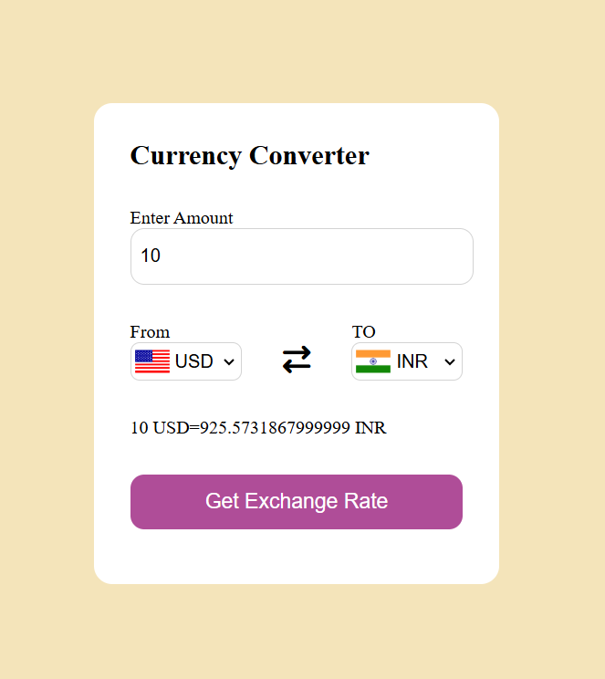

# Currency Converter

A simple web application that converts one currency to another using real-time exchange rates.

## Features

* Convert currency from one country to another
* Real-time exchange rate calculation
* Country flag changes based on selected currency
* Swap option to switch currencies
* Simple and clean user interface

## Technologies Used

* HTML
* CSS
* JavaScript
* Free Currency Exchange API

## How the Project Works

* User enters the amount to convert.
* User selects the **From Currency**.
* User selects the **To Currency**.
* The application requests exchange rate data from a free currency API.
* The correct exchange rate is extracted.
* The entered amount is multiplied by the exchange rate.
* The converted value is displayed to the user.

  ## Screenshot

## Additional Functionality

* Currency dropdowns are generated dynamically.
* Flags update automatically when currency changes.
* Default conversion is shown when the page loads.

## Author

Deepak
